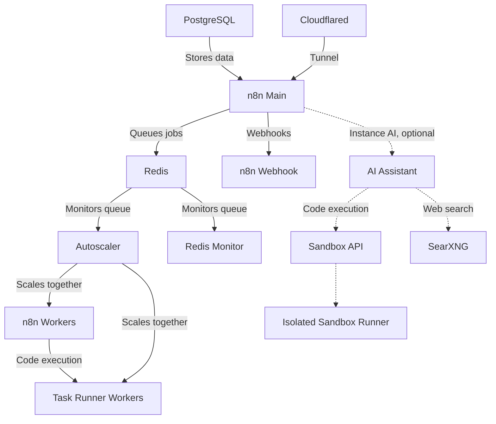

> **This is a maintained fork**, deployed at `n8n.myhomelab.space` on a dedicated VM (VM106, Proxmox). It tracks [conor-is-my-name/n8n-autoscaling](https://github.com/conor-is-my-name/n8n-autoscaling) as the `upstream` git remote on the `homelab-main` branch. Everything below this section is the original upstream README, kept intact; everything in this section is specific to this fork.
>
> For the exhaustive, dated log of individual decisions and failures encountered getting this running, see [`FORK_CHANGES.md`](./FORK_CHANGES.md) — this section is the summary.
>
> **You're on `worklaptop-minimal`, not `homelab-main`.** This branch is a pared-down copy for local dev on a work laptop / Docker Desktop — core n8n + queue + worker + autoscaler + Postgres only. Instance AI, the self-hosted sandbox, SearXNG, and the Daytona provider are removed entirely (their compose files are gone, not just disabled); Cloudflare Tunnel stays defined but is off by default via a `docker-compose.override.yml` profile gate — see [`FORK_CHANGES.md` #7](./FORK_CHANGES.md#7-worklaptop-minimal-branch-pared-down-for-local-dev) for the full list of what was cut and why. `docker compose up -d` (no extra `-f` flags — `docker-compose.override.yml` auto-loads) gets you the minimal stack.
>
> ## Fork history
>
> **Initial deployment.** Reviewed the upstream setup script, compose files, and Postgres init script directly before running anything — no supply-chain issues found, but surfaced two things worth knowing: `N8N_RUNNERS_INSECURE_MODE` / `N8N_RUNNERS_ALLOW_PROTOTYPE_MUTATION` ship `true` by default, and the autoscaler mounts `/var/run/docker.sock` raw. Both flags were turned off; the socket mount was left as-is (VM106 isn't internet-facing, and the autoscaler is a trusted component by design).
>
> **Sandbox isolation.** Instance AI's self-hosted sandbox falls back to a `--privileged` container without Sysbox — host-root-equivalent, upstream itself calls it unsuitable for anything internet-facing. Installed `sysbox-runc` manually (the vendor's installer refuses Debian 13; the `.deb` itself isn't version-locked, so it was verified by checksum and installed directly). Instance AI runs in production isolation, backed by a local Ollama model over its OpenAI-compatible endpoint — no external API key required.
>
> **Infrastructure fixes along the way.** VM106's root filesystem was stuck at 2.8GB despite a 32GB disk allocation (grown via `growpart`/`resize2fs`). An encryption-key mismatch surfaced later — traced to a container that was never restarted after `.env` changed, not a bug in n8n itself — fixed by clearing the stale settings file so it regenerated from the correct key.
>
> **Migrated from a prior LXC-hosted instance.** 5 workflows and 14 credentials moved over via n8n's own `export`/`import` CLI (not a raw `pg_dump`, to stay version-safe across the schema gap) — the encryption key was piped host-to-host so it never touched a terminal or a file that got read into a conversation.
>
> **Version bump to 2.38.6, with the Corepack fix upstream doesn't have.** Bumping past 2.36.8 broke `Dockerfile.runner`'s build — Node 25+ dropped bundled Corepack, and the runner's final-stage base image has neither `apk` nor `npm` to install a replacement (`apk` was removed upstream in `runners` v2.1.0+). Fixed by building Corepack in a throwaway stage and `COPY`-ing it in, the same pattern already used here for chromium/ffmpeg/imagemagick. That alone wasn't enough: the existing `pnpm@10` pin (itself an earlier upstream fix, see their `v2.1.1` tag) started failing too, because `n8nio/runners:2.38.6` itself now ships `node_modules` linked against `pnpm@11.22.0` — pinning v10 against a v11-linked base reintroduces the exact `ERR_PNPM_UNEXPECTED_STORE` error the pin was meant to prevent. Re-pinned to match. **This is not a permanent pin** — see the maintenance process below.
>
> ## Maintaining this fork
>
> Every upstream release gets reviewed, never auto-merged. Process, in full in `FORK_CHANGES.md`:
>
> 1. `git fetch upstream` and skim `git log homelab-main..upstream/main --oneline`
> 2. Check specifically whether upstream touched `Dockerfile.runner`'s Corepack/pnpm step, or the runner security flags — if so, this fork's patches may be redundant or need re-verification
> 3. Before any future n8n version bump, re-check what pnpm version the new `n8nio/runners` base actually ships with — it has changed at least once already:
>    ```
>    docker run --rm -u root --entrypoint sh n8nio/runners:<version> -c \
>      "cat /opt/runners/task-runner-javascript/node_modules/.modules.yaml" \
>      | grep packageManager
>    ```
> 4. Build in isolation (`docker compose build`, no `up`) before touching anything running
> 5. Snapshot first: tag the current working images, copy `.env` aside, `pg_dump` the live database — a bad migration needs the database itself restorable, not just the old code pointed back at it
> 6. Cut over, verify every container reaches healthy, verify workflows/credentials still decrypt, verify Instance AI still responds
> 7. Commit and tag the verified state
>
> ---

# n8n Autoscaling System (n8n 2.0 + Instance AI Ready)

A Docker-based autoscaling solution for n8n workflow automation platform. Dynamically scales worker containers based on Redis queue length. No need to deal with k8s or any other container scaling provider - a simple script runs it all and is easily configurable.

**Now updated for n8n 2.0** with external task runners support and optional n8n Instance AI sandbox providers.

Tested with hundreds of simultaneous executions running on an 8 core 16gb ram VPS.

Includes Puppeteer and Playwright with Chromium built-in for pro level scraping from the n8n code node. Stealth plugins included for bot detection evasion.

Simple install, just clone the files + docker compose up

## What's New in n8n 2.0

n8n 2.0 introduced breaking changes for task runners:
- Task runners are now **separate containers** (external mode)
- Each worker needs its own task runner sidecar
- The main n8n instance does not need a task runner since all executions are offloaded to workers
- External packages must be configured in the task runner image

This build handles all of this automatically - the autoscaler scales both workers and their task runners together.

## Architecture Overview



### Services

| Service | Description |
|---------|-------------|
| `n8n` | Main n8n instance (editor, API) |
| `n8n-webhook` | Dedicated webhook processor |
| `n8n-worker` | Queue workers (autoscaled) |
| `n8n-worker-runner` | Task runners for workers (autoscaled 1:1 with workers) |
| `redis` | Job queue |
| `postgres` | Database (with pgvector) |
| `n8n-autoscaler` | Monitors queue and scales workers + runners |
| `redis-monitor` | Queue monitoring |
| `n8n-backup` | Scheduled backups to cloud storage (optional) |
| `cloudflared` | Cloudflare tunnel |
| `sandbox-api` | Internal self-hosted Instance AI sandbox API (optional) |
| `sandbox-runner-1` | Sysbox or privileged Docker-in-Docker sandbox runner (optional) |
| `sandbox-certs` | One-shot mTLS certificate bootstrap (optional) |
| `searxng` | Internal web search for Instance AI (optional) |

> **Note:** The main n8n instance does not need its own task runner because all executions (including manual runs) are offloaded to workers via `OFFLOAD_MANUAL_EXECUTIONS_TO_WORKERS=true`. Each worker has its own task runner sidecar.

## Features

- Dynamic scaling of n8n worker containers based on queue length
- **n8n 2.0 compatible** - external task runners with proper sidecar scaling
- Configurable scaling thresholds and limits
- Redis queue monitoring with password authentication
- Docker Compose based deployment with modular override files
- Health checks and centralized log rotation for all services
- **Security hardened** - Redis auth, localhost port binding, PostgreSQL user separation, non-root containers
- Puppeteer and Playwright with Chromium for web scraping in Code nodes
- Stealth plugins for bot detection evasion
- External npm packages (ajv, puppeteer-core, playwright-core, etc.)
- Scheduled backups with PostgreSQL + Redis + volume data, GPG encryption, multi-cloud upload
- Interactive setup wizard and systemd service generator
- Instance AI wizard choice: self-hosted n8n Sandbox, Daytona, or disabled
- Automatic self-hosted sandbox mTLS secrets, internal SearXNG, health checks, and isolation selection
- Multi-architecture support (amd64, arm64, armhf)
- Podman rootless support via compose override
- Example workflows ready to import

## Prerequisites

- Docker and Docker Compose (or Podman with podman-compose)
- If you are a new user, I recommend either Docker Desktop or using the docker convenience script for Ubuntu
- Set up your Cloudflare domain and subdomains
- Self-hosted Instance AI sandbox: rootful Docker 24+; production Linux also requires [sysbox-runc](https://github.com/n8n-io/n8n-sandbox-service/blob/main/docs/quickstart-linux.md)

Podman and rootless Docker remain supported for the core autoscaling stack and the Daytona option, but not for the upstream self-hosted n8n Sandbox Service.

Container named volumes belong to one daemon identity—not just an engine name. Docker vs Podman, rootless vs rootful mode, and different local API sockets/contexts can all point at separate data stores. The wizard persists all three fields and blocks an identity change rather than starting n8n against an empty database. To migrate, back up and stop the recorded daemon, restore and verify the data on the selected daemon, then update `CONTAINER_RUNTIME`, `CONTAINER_RUNTIME_MODE`, and `DOCKER_SOCK` in `.env` to that verified destination before rerunning the wizard.

## Quick Start

### Option A: Interactive Setup Wizard (Recommended)

```bash
git clone https://github.com/conor-is-my-name/n8n-autoscaling.git
cd n8n-autoscaling
./n8n-setup.sh
```

The setup wizard will guide you through:
- Creating `.env` from the template
- Generating secure random secrets
- Configuring timezone, URLs, Cloudflare tunnel, Tailscale
- Setting autoscaling parameters
- Configuring backups (schedule, encryption, cloud storage, notifications)
- Detecting your container runtime (Docker/Podman, rootless/rootful)
- Choosing self-hosted n8n Sandbox, Daytona, or no Instance AI sandbox
- Generating and preserving sandbox mTLS/API secrets and the complete Compose file list
- Creating the external network
- Starting all services with health checks

### Option B: Manual Setup

1. Clone this repository:
   ```bash
   git clone https://github.com/conor-is-my-name/n8n-autoscaling.git
   cd n8n-autoscaling
   ```

2. Copy the example environment file:
   ```bash
   cp .env.example .env
   ```

3. Configure your environment variables in `.env`:
   - Set strong passwords for `REDIS_PASSWORD`, `POSTGRES_ADMIN_PASSWORD`, `POSTGRES_PASSWORD`, `N8N_ENCRYPTION_KEY`, `N8N_RUNNERS_AUTH_TOKEN`
   - Update domain settings (`N8N_HOST`, `N8N_WEBHOOK`, etc.)
   - Add your `CLOUDFLARE_TUNNEL_TOKEN`
   - Optionally set `TAILSCALE_IP` for private access
   - For Instance AI, use the wizard or follow the provider configuration below

4. Create the external network:
   ```bash
   docker network create shark
   ```

5. Start everything:
   ```bash
   docker compose up -d --build
   ```

## Configuration

### Key Environment Variables

| Variable | Description | Default |
|----------|-------------|---------|
| `MIN_REPLICAS` | Minimum number of worker containers | 1 |
| `MAX_REPLICAS` | Maximum number of worker containers | 5 |
| `SCALE_UP_QUEUE_THRESHOLD` | Queue length to trigger scale up | 5 |
| `SCALE_DOWN_QUEUE_THRESHOLD` | Queue length to trigger scale down | 1 |
| `POLLING_INTERVAL_SECONDS` | How often to check queue length | 10 |
| `COOLDOWN_PERIOD_SECONDS` | Time between scaling actions | 10 |

### Task Runner Configuration (n8n 2.0)

| Variable | Description | Default |
|----------|-------------|---------|
| `N8N_RUNNERS_ENABLED` | Enable external task runners | true |
| `N8N_RUNNERS_MODE` | Task runner mode | external |
| `N8N_RUNNERS_AUTH_TOKEN` | Auth token for runners | (set your own) |
| `N8N_RUNNERS_MAX_CONCURRENCY` | Max concurrent tasks per runner | 5 |
| `NODE_FUNCTION_ALLOW_EXTERNAL` | Allowed npm packages in Code nodes | ajv,puppeteer-core,playwright-core,... |

### Instance AI and Sandbox Providers (Preview)

n8n Instance AI can use either provider; Daytona is not mandatory. The setup wizard offers:

| Option | What the wizard configures | Runtime support |
|--------|----------------------------|-----------------|
| Self-hosted n8n Sandbox | mTLS certificates, internal sandbox API, one isolated runner, generated secret pairs, persistent API state, and internal SearXNG | Rootful Docker only; Sysbox for production Linux or explicitly acknowledged privileged mode for local/test |
| Daytona | Daytona URL, API key, sandbox image, and lifecycle defaults | Docker or Podman |
| Disabled | Adds `instance-ai` to `N8N_DISABLED_MODULES` and runs no sandbox services | Any supported runtime |

Instance AI is still Preview. [n8n's product documentation](https://docs.n8n.io/deploy/host-n8n/configure-n8n/set-up-ai-assistant) recommends Daytona for production and describes its own sandbox as a local development/testing option. This project also supports the sandbox service's Sysbox topology for operators who deliberately choose to own that production infrastructure; that does not change n8n's provider recommendation.

The self-hosted services do not publish host ports. Instance AI/model variables are injected only into the main `n8n` service; webhook processors and workers do not receive them in their environments. The autoscaler remains a privileged component: it mounts this project (including `.env`) and the container-engine socket so it can recreate workers. The wizard stores the selected ordered overrides in `COMPOSE_FILE`, so ordinary commands such as `docker compose up -d`, systemd startup, and autoscaler-created workers all retain the same configuration.

Instance AI also needs a model credential. The wizard can save `N8N_INSTANCE_AI_MODEL`, `N8N_INSTANCE_AI_MODEL_API_KEY`, and an optional OpenAI-compatible `N8N_INSTANCE_AI_MODEL_URL`, or you can configure the model later in n8n's AI settings. Leaving the model variables unset/commented keeps model selection editable in the UI; setting them makes the model environment-managed. The sandbox infrastructure can be healthy before a model is configured, but the assistant cannot answer until a model is available.

This stack pins both n8n and its external task runner to `2.36.8`, the version used to validate the integration and sandbox protocol; 2.35.7 is the minimum supported release. The wizard records that pin in existing environments when it is missing. Change the server and task-runner version together, then retest the sandbox. The stack intentionally uses the canonical [`N8N_SANDBOX_SERVICE_URL` and `N8N_SANDBOX_SERVICE_API_KEY`](https://github.com/n8n-io/n8n/blob/n8n%402.36.8/packages/%40n8n/config/src/configs/instance-ai.config.ts#L59-L85). Do not use `N8N_INSTANCE_AI_SANDBOX_API_URL` or `N8N_INSTANCE_AI_SANDBOX_API_KEY`; n8n does not read those names.

On an existing n8n database, the saved AI Assistant and Sandbox on/off values take precedence over their environment defaults. The wizard provisions a valid environment-managed provider connection, but it cannot safely edit n8n's database-backed admin settings. After enabling the feature on an existing installation, verify both AI Assistant and Sandbox are enabled in AI Assistant settings once. When switching providers, also verify the selected provider and disconnect the old saved sandbox connection if it remains selected. Fresh installations use the wizard's enabled defaults. The disabled wizard option is authoritative because it adds `instance-ai` to `N8N_DISABLED_MODULES`, so saved toggles cannot reactivate the module. For Daytona, n8n also lets a previously saved sandbox image override the environment image; verify that setting if a migrated Daytona sandbox fails to start.

#### Self-hosted isolation

On Linux production hosts, install Sysbox first and verify that `docker info --format '{{json .Runtimes}}'` lists `sysbox-runc`. The wizard detects it and automatically selects `docker-compose.ai-sandbox.sysbox.yml`. This is the [upstream production Linux topology](https://github.com/n8n-io/n8n-sandbox-service/blob/main/docs/quickstart-linux.md). The pinned sandbox images support amd64 and arm64; the wizard rejects unsupported host architectures. Docker Engine 24+, the Docker Compose v2 plugin, and a Linux kernel newer than 5.19 are required; review the upstream distro constraints before installing Sysbox.

If Sysbox is absent, the wizard can use `docker-compose.ai-sandbox.privileged.yml` only after an explicit warning. A privileged Docker-in-Docker runner is host-root-equivalent and is intended for Docker Desktop or local/test use, not an internet-facing production server. The API and runner remain on a dedicated bridge with no published ports in either mode. **This fork diverges from upstream on SearXNG's exposure** — see `FORK_CHANGES.md` #4: SearXNG's port is published bound to the host's own LAN IP (not `0.0.0.0`), so it's reachable from the LAN/reverse proxy without a published-on-all-interfaces port. Upstream's default of no published SearXNG port at all is safer if you don't need LAN-level access to it directly.

The validated image bundle pins the sandbox service to `1.1.1`, its transitional inner sandbox image to `1.1.0`, and SearXNG to `2026.9.12-d4f00d15d` (this fork rebuilds SearXNG on top of that tag via `Dockerfile.searxng` — see `FORK_CHANGES.md` #4/#5 for the privacy hardening and BM25 reranker layered in, and why the pin gets bumped periodically). These versions passed the n8n 2.36.8 create/execute/delete smoke test. Do not change them independently or use floating `latest`/`stable` tags: future unified sandbox releases must move the API, runner, and inner image together, and transport changes may require coordinated certificate paths and health checks.

#### Manual provider selection

The wizard is recommended because it generates three independent secret pairs and keeps upgrades idempotent. For a manual self-hosted setup, the important relationships are:

```env
COMPOSE_FILE=docker-compose.yml:docker-compose.instance-ai.yml:docker-compose.ai-sandbox.yml:docker-compose.ai-sandbox.sysbox.yml
ENABLE_AI_ASSISTANT=true
N8N_ENABLED_MODULES=instance-ai
N8N_DISABLED_MODULES=
N8N_INSTANCE_AI_SANDBOX_ENABLED=true
N8N_INSTANCE_AI_SANDBOX_PROVIDER=n8n-sandbox
N8N_SANDBOX_ISOLATION=sysbox
N8N_SANDBOX_SERVICE_URL=http://sandbox-api:8080
N8N_INSTANCE_AI_SEARXNG_URL=http://searxng:8080

# Generate A, B, and C independently with `openssl rand -hex 32`.
SANDBOX_API_KEYS=A
N8N_SANDBOX_SERVICE_API_KEY=A
SANDBOX_API_RUNNER_REGISTRATION_TOKEN=B
SANDBOX_RUNNER_REGISTRATION_TOKEN=B
SANDBOX_API_RUNNER_API_KEY=C
SANDBOX_RUNNER_API_KEYS=C
SEARXNG_SECRET=GENERATE_ANOTHER_SECRET
```

For Daytona:

```env
COMPOSE_FILE=docker-compose.yml:docker-compose.instance-ai.yml:docker-compose.ai-daytona.yml
ENABLE_AI_ASSISTANT=true
N8N_ENABLED_MODULES=instance-ai
N8N_DISABLED_MODULES=
N8N_INSTANCE_AI_SANDBOX_ENABLED=true
N8N_INSTANCE_AI_SANDBOX_PROVIDER=daytona
DAYTONA_API_URL=https://app.daytona.io/api
DAYTONA_API_KEY=YOUR_DAYTONA_API_KEY
```

Keep `.env` mode `0600`. Switching providers through the wizard preserves dormant credentials but removes their Compose override, so stale provider secrets are not forwarded to application containers. Starting with `--remove-orphans` removes containers from the previously selected provider without deleting its data volumes.

### Timeout Configuration

Adjust these to be greater than your longest expected workflow execution time (in seconds):
```
N8N_QUEUE_BULL_GRACEFULSHUTDOWNTIMEOUT=300
N8N_GRACEFUL_SHUTDOWN_TIMEOUT=300
```

## Scaling Behavior

The autoscaler:
1. Monitors Redis queue length every `POLLING_INTERVAL_SECONDS`
2. Scales up when:
   - Queue length > `SCALE_UP_QUEUE_THRESHOLD`
   - Current replicas < `MAX_REPLICAS`
3. Scales down when:
   - Queue length < `SCALE_DOWN_QUEUE_THRESHOLD`
   - Current replicas > `MIN_REPLICAS`
4. Respects cooldown period between scaling actions
5. **Scales workers and task runners together** (1:1 ratio)
6. Reuses the same ordered Compose files that launched the stack, so override
   configuration is preserved when workers are created or recreated

## Security

### Redis Authentication

Redis requires password authentication. Set `REDIS_PASSWORD` in your `.env` file. The password is automatically propagated to all services that connect to Redis (n8n, autoscaler, monitor, backup).

### Port Binding

By default, all ports bind to `127.0.0.1` (localhost only). This means services are not accessible from external networks unless you:
- Set `TAILSCALE_IP` to bind to your Tailscale interface
- Use the Cloudflare tunnel for external access

### PostgreSQL User Separation

The system uses two PostgreSQL users:
- **Admin user** (`POSTGRES_ADMIN_USER`/`POSTGRES_ADMIN_PASSWORD`): Superuser for database management
- **Application user** (`POSTGRES_USER`/`POSTGRES_PASSWORD`): Limited-privilege user for n8n

The `init-postgres.sh` script runs on first PostgreSQL initialization to create the application database and user. Set `POSTGRES_APP_PASSWORD` in `.env` to enable this separation.

### Instance AI Sandbox Isolation

The self-hosted sandbox uses mutual TLS for API/runner gRPC registration and control, separate random API/registration secrets, and an unexposed dedicated Docker network. In the pinned 1.1.1 protocol, runner HTTP traffic stays on that private network; newer sandbox releases change this transport and must be upgraded as a coordinated set. Certificate bootstrap keeps the CA private key in temporary memory and copies only role-specific leaf material into separate API and runner volumes. AI secrets are not injected into webhook or worker environments; the autoscaler can still read `.env` because its project and engine-socket mounts already make it a trusted, host-equivalent component.

Sysbox is the production isolation path on Linux. The privileged fallback grants the runner broad host-kernel capabilities and must be treated as host-root-equivalent even though its ports are internal. Never publish ports `8080`, `9090`, or `9091` from the sandbox services.

## Compose Override Files

Modular override files allow you to customize the deployment without editing the main `docker-compose.yml`:

| File | Purpose | Usage |
|------|---------|-------|
| `docker-compose.cloudflare.yml` | Binds n8n to localhost only (Cloudflare handles access) | `-f docker-compose.yml -f docker-compose.cloudflare.yml` |
| `docker-compose.instance-ai.yml` | Main-instance-only Instance AI/model configuration | Included for either sandbox provider |
| `docker-compose.ai-daytona.yml` | Daytona credentials and lifecycle policy | Added when Daytona is selected |
| `docker-compose.ai-sandbox.yml` | Self-hosted API, runner, mTLS, persistent state, and SearXNG | Added when self-hosted is selected |
| `docker-compose.ai-sandbox.sysbox.yml` | Production Linux Sysbox runner isolation | Added after the self-hosted override |
| `docker-compose.ai-sandbox.privileged.yml` | Local/test privileged runner isolation | Added after the self-hosted override |
| `docker-compose.podman.yml` | Adds `:Z,U` flags for rootless Podman SELinux/UID mapping | `-f docker-compose.yml -f docker-compose.podman.yml` |

Example with Cloudflare override:
```bash
docker compose -f docker-compose.yml -f docker-compose.cloudflare.yml up -d
```

The autoscaler reads Docker Compose's configuration labels from its own
container and passes the same ordered file set to every scale command. This
also covers the conventional `docker-compose.override.yml` file loaded by a
plain `docker compose up -d` command.

Run Compose from this repository directory. The project is mounted read-only
into the autoscaler at the same absolute host path so relative `env_file` and
bind-mount paths continue to resolve correctly. For systemd,
`generate-systemd.sh` records this path automatically. For another launcher or
when invoking Compose from a different directory, set:

```env
AUTOSCALER_PROJECT_DIRECTORY=/absolute/path/to/n8n-autoscaling
```

For advanced deployments, `COMPOSE_FILE_PATHS` can explicitly override label
discovery. It is an ordered list separated by `:` on Linux/macOS; set
`COMPOSE_PATH_SEPARATOR` to use another separator. Every configured file must
be readable inside the autoscaler container. `COMPOSE_FILE_PATH` remains
available as a backward-compatible single-file fallback.

To enable the Cloudflare override with the setup wizard or systemd generator, set `ENABLE_CLOUDFLARE_OVERRIDE=true` in your `.env`. The wizard updates `COMPOSE_FILE` whenever the runtime or Instance AI provider changes while preserving custom override files at the end of the list.

## Systemd Integration

Generate a systemd service file for automatic startup:

```bash
./generate-systemd.sh
```

The generator will:
- Detect Docker vs Podman and rootless vs rootful mode
- Install a runtime wrapper that reads `CONTAINER_RUNTIME`, its persisted mode/socket identity, and `COMPOSE_FILE` on every lifecycle action
- Follow later provider/Compose changes and same-scope Docker/Podman changes without baking old commands into the unit
- Order shutdown before Docker or the Podman API socket stops, and wait briefly for the selected engine during parallel boot
- Create a system service for rootful engines (requesting `sudo` only to install/manage it) or a user service for rootless engines
- Optionally enable and start the service

Older `.env` files may not contain `CONTAINER_RUNTIME_MODE`; run `./n8n-setup.sh` once after upgrading so the wizard can infer the identity only when the current daemon actually owns the project data. Then run `./generate-systemd.sh` to replace units containing hard-coded `-f` flags. Regenerating an active unit restarts it so provider changes take effect immediately. Regenerate again after a verified change between rootless and rootful operation because those modes belong to different systemd managers.

For Podman, the wizard requires a local active Unix API socket and starts `podman.socket` through systemd when possible. It rejects remote Podman connections because a remote server path cannot safely be bind-mounted into the autoscaler.

## Log Rotation

All services use centralized log rotation configured via `.env`:

```env
LOG_DRIVER=json-file    # Docker log driver
LOG_MAX_SIZE=10m        # Max size per log file
LOG_MAX_FILE=3          # Number of log files to retain
```

## Performance Tuning

See the "Performance Tuning" section at the bottom of `.env.example` for tuning guidance organized by workload tier:
- **Light** (2-4GB RAM): Small teams, <100 workflows
- **Medium** (8-16GB RAM): Teams, 100-500 workflows
- **Heavy** (32GB+ RAM): Large-scale, 500+ workflows with high concurrency

## Adding External Packages

### Pre-installed JavaScript Packages

The following npm packages are pre-installed and ready to use in JavaScript Code nodes:

| Package | Description |
|---------|-------------|
| `puppeteer-core` | Browser automation (Puppeteer) |
| `puppeteer-extra` | Puppeteer with plugin support |
| `puppeteer-extra-plugin-stealth` | Bot detection evasion |
| `playwright-core` | Browser automation (Playwright) |
| `playwright-extra` | Playwright with plugin support |
| `ajv` | JSON schema validation |
| `ajv-formats` | Additional AJV formats |
| `moment` | Date/time manipulation |

### Pre-installed Python Packages

The following pip packages are pre-installed for Python Code nodes:

| Package | Description |
|---------|-------------|
| `requests` | HTTP library |
| `pillow` | Image processing (PIL) |
| `pandas` | Data analysis |
| `numpy` | Numerical computing |

### Pre-installed System Utilities

The following command-line tools are available via `subprocess`:

| Tool | Description |
|------|-------------|
| `chromium` | Headless browser |
| `ffmpeg` / `ffprobe` | Video/audio processing |
| `imagemagick` | Image manipulation (`magick`, `convert`, `identify`, `mogrify`, `composite`) |
| `graphicsmagick` | Image manipulation (`gm`) |
| `git` | Version control |

### Adding More npm Packages

To add additional npm packages for JavaScript Code nodes:

1. Edit `Dockerfile.runner` and add packages to the pnpm install:
   ```dockerfile
   RUN /usr/local/bin/node /usr/local/lib/node_modules/corepack/dist/corepack.js pnpm add \
       ajv \
       ajv-formats \
       puppeteer-core@22.15.0 \
       your-package-here
   ```

2. Edit `n8n-task-runners.json` and add your package to the allowlist:
   ```json
   "NODE_FUNCTION_ALLOW_EXTERNAL": "moment,ajv,ajv-formats,puppeteer-core,playwright-core,your-package-here"
   ```

3. Rebuild:
   ```bash
   docker compose build --no-cache n8n-worker-runner
   docker compose up -d
   ```

### Adding More Python Packages

To add additional pip packages for Python Code nodes:

1. Edit `Dockerfile.runner` and add packages to the uv pip install:
   ```dockerfile
   RUN /usr/local/bin/uv pip install --python /opt/runners/task-runner-python/.venv/bin/python --no-cache \
       requests \
       pillow \
       pandas \
       numpy \
       your-package-here
   ```

2. Edit `n8n-task-runners.json` and update the Python runner's env-overrides:
   ```json
   "N8N_RUNNERS_EXTERNAL_ALLOW": "requests,pillow,PIL,pandas,numpy,your-package-here"
   ```

3. If your package needs stdlib modules (like `subprocess`), add them too:
   ```json
   "N8N_RUNNERS_STDLIB_ALLOW": "datetime,json,math,os,re,io,base64,hashlib,urllib,subprocess"
   ```

4. Rebuild:
   ```bash
   docker compose build --no-cache n8n-worker-runner
   docker compose up -d
   ```

### Adding System Utilities (Linux packages)

To add command-line tools (like ImageMagick, tesseract, poppler, etc.):

1. Edit `Dockerfile.runner` and add packages to the Alpine builder stage:
   ```dockerfile
   FROM alpine:3.23 AS builder

   RUN apk add --no-cache \
       chromium \
       ... \
       imagemagick \
       tesseract-ocr \
       poppler-utils
   ```

2. Add COPY commands to copy the binaries to the final image:
   ```dockerfile
   # Copy binaries from builder
   COPY --from=builder /usr/bin/tesseract /usr/bin/tesseract
   COPY --from=builder /usr/bin/pdftotext /usr/bin/pdftotext
   ```

3. Rebuild:
   ```bash
   docker compose build --no-cache n8n-worker-runner
   docker compose up -d
   ```

**Note:** The runner image uses a multi-stage build. System packages are installed in an Alpine builder stage, then binaries and libraries are copied to the final `n8nio/runners` image. This is necessary because the base runners image doesn't include `apk`.

### Installing Community Nodes

Community nodes are third-party n8n nodes that add new integrations (e.g., n8n-nodes-discord, n8n-nodes-notion). They're different from Code node packages - they add entirely new node types to your workflow editor.

**Via the n8n UI (Recommended):**

1. Ensure community packages are enabled (they are by default in this build):
   ```env
   N8N_COMMUNITY_PACKAGES_ENABLED=true
   ```

2. In n8n, go to **Settings** > **Community nodes**

3. Click **Install** and enter the npm package name (e.g., `n8n-nodes-discord`)

4. The node will be installed to the shared volume and available to all workers automatically

**Pre-installing in Dockerfile (for consistent deployments):**

1. Edit `Dockerfile` and add the community node package:
   ```dockerfile
   # Install community nodes
   RUN cd /usr/local/lib/node_modules/n8n && \
       npm install n8n-nodes-discord n8n-nodes-notion
   ```

2. Rebuild all n8n images:
   ```bash
   docker compose build --no-cache n8n n8n-webhook n8n-worker
   docker compose up -d
   ```

**Important notes:**
- Community nodes are installed into **n8n itself**, not the task runners
- The `n8n_main` volume is shared between `n8n` and `n8n-worker`, so nodes installed via UI are automatically available to workers
- If a community node requires system dependencies, you may need to add them to the main `Dockerfile` (not `Dockerfile.runner`)

## Monitoring

The system includes:
- Redis queue monitor service (`redis-monitor`)
- Docker health checks for all services
- Detailed logging from autoscaler

View logs:
```bash
# All services
docker compose logs -f

# Specific service
docker compose logs -f n8n-autoscaler

# Task runners
docker compose logs -f n8n-worker-runner
```

## Backup Configuration

The `n8n-backup` service provides scheduled backups of your PostgreSQL database and n8n volume data, with optional encryption and multi-cloud storage upload via [rclone](https://rclone.org/).

### What Gets Backed Up

- **PostgreSQL database** (workflows, credentials, executions, users) via `pg_dump`
- **Redis data** (job queue state) via `BGSAVE` + compressed RDB dump
- **n8n volume data** (custom nodes, local file storage) via tar archive
- Everything bundled into a single timestamped `.tar.gz` archive

### Quick Setup

1. Copy the example rclone config:
   ```bash
   cp backup/rclone.conf.example backup/rclone.conf
   ```

2. Edit `backup/rclone.conf` with your cloud storage credentials (see [rclone docs](https://rclone.org/docs/) for your provider)

3. Uncomment the rclone.conf volume mount in `docker-compose.yml`:
   ```yaml
   - ./backup/rclone.conf:/config/rclone/rclone.conf:ro
   ```

4. Add backup settings to your `.env`:
   ```env
   COMPOSE_PROFILES=backup
   BACKUP_RCLONE_DESTINATIONS=r2:my-bucket/n8n-backups
   BACKUP_SCHEDULE=0 2 * * *
   ```

5. Start the backup service:
   ```bash
   docker compose up -d
   ```
   Or start it explicitly without modifying `.env`:
   ```bash
   docker compose --profile backup up -d
   ```

### Backup Environment Variables

| Variable | Description | Default |
|----------|-------------|---------|
| `BACKUP_SCHEDULE` | Cron schedule for backups | `0 2 * * *` (daily 2 AM) |
| `BACKUP_RETENTION_DAYS` | Days to keep old backups | `30` |
| `BACKUP_ENCRYPTION_KEY` | GPG passphrase (empty = no encryption) | (empty) |
| `BACKUP_RCLONE_DESTINATIONS` | Comma-separated rclone remotes | (empty = local only) |
| `BACKUP_RUN_ON_START` | Run backup immediately on container start | `false` |
| `BACKUP_DELETE_LOCAL_AFTER_UPLOAD` | Delete local copy after successful remote upload | `false` |
| `BACKUP_WEBHOOK_URL` | Webhook URL for notifications | (empty) |
| `SMTP_HOST` | SMTP server for email notifications | (empty) |
| `SMTP_PORT` | SMTP port | `587` |
| `SMTP_USER` | SMTP username | (empty) |
| `SMTP_PASSWORD` | SMTP password | (empty) |
| `SMTP_TO` | Notification email recipient | (empty) |

### Multiple Cloud Destinations

Upload to multiple providers simultaneously by comma-separating destinations:
```env
BACKUP_RCLONE_DESTINATIONS=r2:my-bucket/n8n,s3:backup-bucket/n8n,b2:my-b2-bucket/n8n
```

### Testing Backups

Run a one-off backup to verify your configuration:
```env
BACKUP_RUN_ON_START=true
```
```bash
docker compose --profile backup up n8n-backup
```

### Restoring from a Backup

1. **Decrypt** (if encrypted):
   ```bash
   gpg --decrypt n8n-backup-TIMESTAMP.tar.gz.gpg > n8n-backup-TIMESTAMP.tar.gz
   ```

2. **Extract** the archive:
   ```bash
   tar xzf n8n-backup-TIMESTAMP.tar.gz
   ```

3. **Restore the database**:
   ```bash
   docker compose exec -T postgres pg_restore -U postgres -d n8n --clean --if-exists < database.dump
   ```

4. **Restore volume data** (stop n8n first):
   ```bash
   docker compose stop n8n n8n-worker n8n-webhook
   tar xzf volumes.tar.gz -C /var/lib/docker/volumes/n8n-autoscaling_n8n_main/_data/
   docker compose start n8n n8n-worker n8n-webhook
   ```

**Important:** Your `N8N_ENCRYPTION_KEY` and `N8N_USER_MANAGEMENT_JWT_SECRET` must match the values used when the backup was created, otherwise n8n credentials cannot be decrypted. Keep these values safe separately from your backups.

## Updating

To update:
```bash
docker compose down
docker compose build --no-cache
docker compose up -d
```

## Troubleshooting

### Check container status
```bash
docker compose ps
```

### Check logs
```bash
docker compose logs [service]
```

### Verify Redis connection
```bash
docker compose exec redis redis-cli --no-auth-warning -a "$REDIS_PASSWORD" ping
```

### Check queue length
```bash
docker compose exec redis redis-cli --no-auth-warning -a "$REDIS_PASSWORD" LLEN bull:jobs:wait
```

### Task runner issues
If Code nodes fail, check worker task runner logs:
```bash
docker compose logs n8n-worker-runner
```

### Instance AI sandbox issues

Check the internal API, runner, and search service selected by the wizard:

```bash
docker compose ps sandbox-api sandbox-runner-1 searxng
docker compose logs sandbox-api sandbox-runner-1 searxng
```

For a Sysbox deployment, verify the runtime is registered:

```bash
docker info --format '{{json .Runtimes}}'
```

If `sandbox-certs` shows `Exited (0)`, that is expected: it is a one-shot mTLS bootstrap container. The runner `/readyz` check covers runner readiness, but it does not prove API registration or an end-to-end sandbox create/execute cycle. Inspect both sandbox logs for registration or image-pull errors, and allow extra time for the first sandbox creation after an image change. If the API reports authentication or registration failures, verify each paired value in `.env` is identical, then rerun the wizard; existing valid secrets are preserved. Do not replace the canonical `N8N_SANDBOX_SERVICE_*` variables with the similarly named `N8N_INSTANCE_AI_SANDBOX_API_*` variables.

The role certificates are deliberately not rotated underneath running API/runner containers. Before they expire, schedule a maintenance window, run `docker compose down`, remove both `<project>_sandbox_api_tls` and `<project>_sandbox_runner_tls` volumes together, then run `docker compose up -d --build`. The one-shot bootstrap will create one new CA and both matching role bundles. Never remove `sandbox_api_data`, PostgreSQL, Redis, or n8n data volumes during this procedure; removing only one TLS volume is rejected to prevent a split CA.

The assistant UI can be present while chat remains unavailable if no model key or custom model endpoint is configured. Set it through the wizard, n8n AI settings, or the `N8N_INSTANCE_AI_MODEL*` variables and recreate the main service.

### Webhook URL format
Webhooks use your Cloudflare subdomain:
```
https://webhook.yourdomain.com/webhook/your-webhook-id
```

## File Structure

```
.
├── docker-compose.yml              # Main compose file
├── docker-compose.cloudflare.yml   # Cloudflare tunnel override (localhost binding)
├── docker-compose.instance-ai.yml  # Main-only Instance AI environment
├── docker-compose.ai-daytona.yml   # Daytona provider override
├── docker-compose.ai-sandbox.yml   # Self-hosted sandbox API/runner/SearXNG
├── docker-compose.ai-sandbox.sysbox.yml      # Production Linux isolation
├── docker-compose.ai-sandbox.privileged.yml  # Local/test isolation fallback
├── docker-compose.podman.yml       # Podman rootless override (SELinux/UID flags)
├── searxng-settings.yml            # SearXNG config: JSON responses for Instance AI, privacy hardening, BM25/tracker-url plugins (fork addition, see FORK_CHANGES.md)
├── Dockerfile                      # Main n8n image (based on n8nio/n8n)
├── Dockerfile.runner               # Task runner image (based on n8nio/runners)
├── n8n-task-runners.json           # Task runner launcher config
├── init-postgres.sh                # PostgreSQL app user initialization
├── n8n-setup.sh                    # Interactive setup wizard
├── generate-systemd.sh             # Systemd service generator
├── compose-stack.sh                # Runtime-aware systemd lifecycle wrapper
├── .env.example                    # Example environment configuration
├── .env                            # Your configuration (git-ignored)
├── .dockerignore                   # Docker build context exclusions
├── examples/                       # Example n8n workflows
├── autoscaler/
│   ├── Dockerfile                  # Autoscaler container (Python 3.12, multi-arch)
│   └── autoscaler.py               # Scaling logic
├── backup/
│   ├── Dockerfile                  # Backup container
│   ├── backup.py                   # Backup logic (pg_dump + Redis + rclone)
│   └── rclone.conf.example         # Example rclone storage config
└── monitor/
    └── monitor.Dockerfile          # Redis monitor container (non-root)
```

## Task Runner Security Configuration

The `n8n-task-runners.json` file controls security settings for the JavaScript task runner:

| Setting | Description |
|---------|-------------|
| `NODE_ENV=test` | Disables prototype freezing (required for puppeteer/playwright) |
| `NODE_FUNCTION_ALLOW_EXTERNAL` | Comma-separated list of allowed npm packages |
| `NODE_FUNCTION_ALLOW_BUILTIN` | Allowed Node.js built-in modules |
| `PUPPETEER_EXECUTABLE_PATH` | Path to chromium binary |
| `PLAYWRIGHT_CHROMIUM_EXECUTABLE_PATH` | Path to chromium binary for Playwright |

**Note:** The default config removes sandbox restrictions to allow puppeteer/playwright and libraries like AJV that use `new Function()`. If you don't need these, you can restore the original security settings from the n8nio/runners image.

## Example Workflows

The `examples/` folder contains ready-to-import n8n workflows demonstrating browser automation:

| File | Description |
|------|-------------|
| `puppeteer-screenshot.json` | Take screenshots with Puppeteer |
| `puppeteer-scrape.json` | Scrape Hacker News with Puppeteer |
| `puppeteer-stealth.json` | Bot detection evasion test |
| `playwright-screenshot.json` | Take screenshots with Playwright |
| `playwright-scrape.json` | Scrape Hacker News with Playwright |
| `playwright-pdf.json` | Generate PDFs from web pages |
| `playwright-stealth.json` | Bot detection evasion test |

Import via: **Workflows** > **Add Workflow** > **Import from File**

### Quick Example (Puppeteer)

```javascript
const puppeteer = require('puppeteer-core');

const browser = await puppeteer.launch({
  executablePath: '/usr/bin/chromium-browser',
  headless: true,
  args: ['--no-sandbox', '--disable-setuid-sandbox', '--disable-dev-shm-usage']
});

const page = await browser.newPage();
await page.goto('https://example.com');
const title = await page.title();
await browser.close();

return [{ json: { title } }];
```

### Quick Example (Playwright with Stealth)

```javascript
const { chromium } = require('playwright-extra');
const StealthPlugin = require('puppeteer-extra-plugin-stealth');

chromium.use(StealthPlugin());

const browser = await chromium.launch({
  executablePath: '/usr/bin/chromium-browser',
  headless: true,
  args: ['--no-sandbox', '--disable-setuid-sandbox', '--disable-dev-shm-usage']
});

const page = await browser.newPage();
await page.goto('https://example.com');
const title = await page.title();
await browser.close();

return [{ json: { title } }];
```

## License

MIT License - See [LICENSE](LICENSE) for details.

## Credits

For step by step instructions follow this guide: https://www.reddit.com/r/n8n/comments/1l9mi6k/major_update_to_n8nautoscaling_build_step_by_step/

Now includes Cloudflared. Configure on cloudflare.com and paste your token in the .env file.
